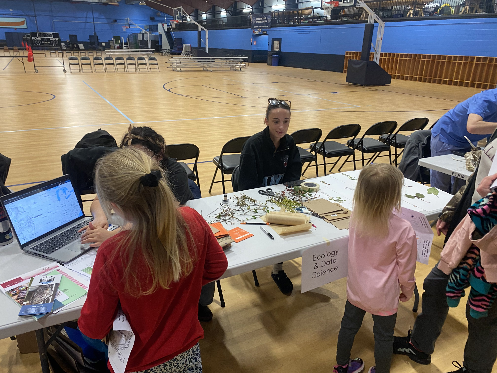
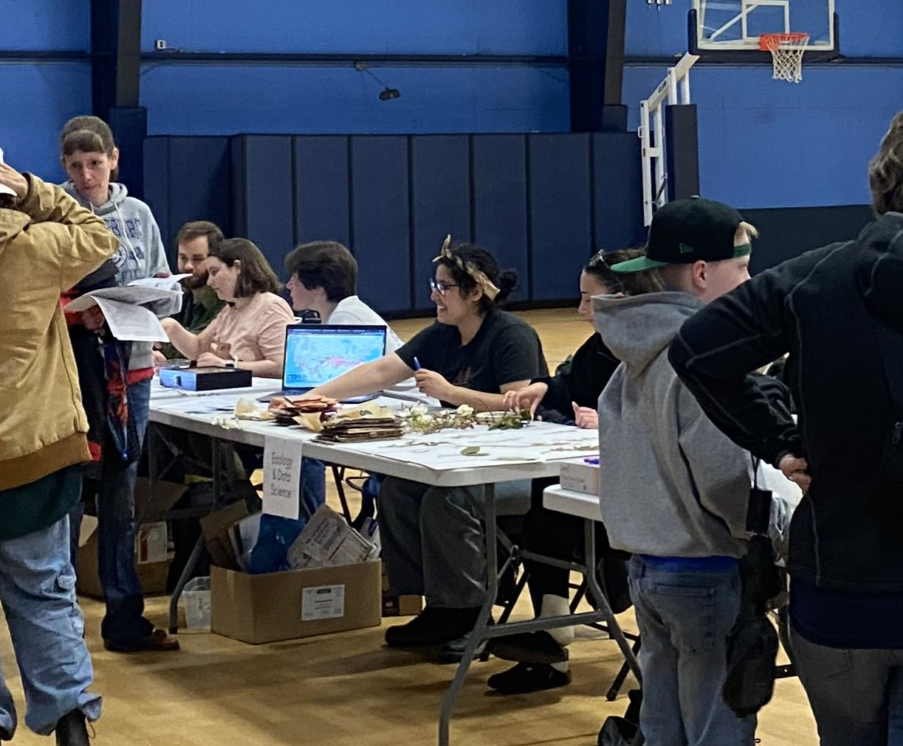

**"Education is an act of love, and thus an act of courage" - Paulo Freire**

**"Cariño \[is\] an act of rebellion and healing" - Yvette Regalado**

## Community Engagement and Service Experience

**Spring 2025** \| Tabling and guided activity \| Meet a Scientist Event \| Hirundo Wildlife Refuge, Maine

**Spring 2024 - Spring 2025** \| Event Coordinator \| DEI Leadership Committee (Dept. Wildlife, Fisheries, and Conservation Biology) \| University of Maine

**Summer 2023** \| Invited Webinar Speaker \| [2023 NBPS SRC/Sigma Xi Research Webinar, South Florida](https://youtu.be/ZkCoa0eO6cM?si=05NLHE9zMw4R3VqD&t=162){target="_blank" rel="noopener"}

**Spring 2022** \| Presenter and Activity Guide \| Library Makerspace Workshop Series \| CSUMB

## Teaching & Mentorship 

**Summer 2025** \| NSF-REU Mentor \| University of Maine \| [Student deliverabe](https://recordlab.shinyapps.io/MainePhenologyShinyApp/) 

**January 2023 - December 2024** \| Teaching Assistant \| Department of Wildlife, Fisheries, and Conservation Biology

## Statement 
Global and regional level agencies are important to establish environmental protections and enforcement, but local communities apply these values into daily life.\
\
I aim to strengthen the bridge between ecological research and community livelihood at the local level. I am interested in taking on projects that emphasize community outreach and engagement regarding environmental issues from marine to terrestrial systems. My background in research and across different systems gives me a holistic perspective on the inter-connectedness between the environment and our local communities.\
\
Lastly, environmental justice is social justice. We can't help the planet if we don't help each other.\
La justicia ambiental es la justicia social. No podemos ayudar la planeta si no podemos ayudar unos a otros.\

## Portfolio 
Below are some examples of my science communication and outreach skills, in both acaemic and non-academic settings\
<!-- 
 -->
<!-- {fig-align="left" style="width:210px; height:200px; border-radius:80%; object-fit:cover; border:1px solid #384755;"} -->

<!-- {fig-align="center" style="width:210px; height:200px; border-radius:80%; object-fit:cover; border:1px solid #384755;"} -->
<!-- 
 -->